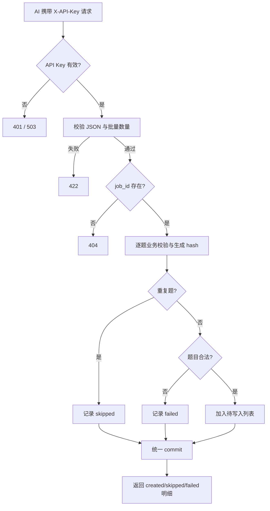

# AI 题库批量写入接口设计

## 1. 背景与目标

当前题库主要写在 `app/seed.py` 中，新增题目需要修改代码并重新灌库。目标是提供一个受 API Key 保护的管理接口，让外部 AI 按固定 JSON 格式批量提交题目，后端校验后增量写入 MySQL。

本次需求的验收目标：

- 提供 `POST /api/admin/questions/batch`；
- 只允许提交已有职业的题目；
- 单次最多提交 100 道；
- 支持单选和多选；
- 重复题自动跳过，不影响其他新题；
- 返回新增、跳过、失败数量及逐题原因；
- 不再要求日常新增题目修改 `seed.py` 或执行 `--reset`；
- 不改变现有前端取题接口。

## 2. 当前代码库现状

- `app/models/job.py` 已有 `Job` 和 `Question` 模型，`questions.job_id` 外键指向 `jobs.id`。
- `Question` 已支持 `qtype='single'/'multi'` 和 `answer_indices` 数组。
- `Question.content_hash` 已有唯一索引，但历史 seed 数据的 `content_hash` 目前可能为 `NULL`。
- `app/db.py` 提供同步 SQLModel `SessionDep`，接口可直接复用。
- `app/main.py` 集中注册各 API router，新增管理 router 需要在这里注册。
- `app/config.py` 已通过 `.env` 管理配置，应新增独立的 `admin_api_key`，不能复用出站的大模型 Key。
- 当前没有通用入站鉴权、管理路由或题库写入服务。

## 3. 技术方案

### 3.1 模块边界

新增：

- `app/api/admin.py`：管理路由、API Key 依赖、请求/响应模型和批量写入编排。
- `app/services/question_bank.py`：题目校验、内容指纹、去重查询和批量持久化逻辑。

修改：

- `app/config.py`：增加 `admin_api_key` 配置，对应环境变量 `ADMIN_API_KEY`。
- `.env.example`：增加配置示例，但不写入真实密钥。
- `app/main.py`：导入并注册 `admin.router`。
- `app/seed.py`：保留作为初始数据和灾备恢复脚本；不再作为日常新增题目的入口。后续可另行迁移静态数据，但不属于本次接口实现。

不新增数据库表。所有题目继续写入现有 `questions` 表。

### 3.2 认证

接口使用请求头：

```http
X-API-Key: <ADMIN_API_KEY>
```

使用 `secrets.compare_digest` 比较请求 Key 和配置 Key。

- 缺失或错误 Key：返回 HTTP 401；
- 服务端未配置 `ADMIN_API_KEY`：返回 HTTP 503，禁止默认放行；
- Key 不得出现在 URL、请求体或普通日志中；
- 认证依赖只挂在 `/api/admin` 路由上，不影响现有公开查询接口。

### 3.3 请求和响应契约

请求：

```http
POST /api/admin/questions/batch
Content-Type: application/json
X-API-Key: <secret>
```

```json
{
  "job_id": "frontend",
  "questions": [
    {
      "qtype": "single",
      "prompt": "React 中 useMemo 的作用是什么？",
      "options": ["缓存计算结果", "发送网络请求", "创建路由", "读取本地文件"],
      "answer_indices": [0],
      "explanation": "useMemo 用于缓存计算结果，只有依赖变化时才重新计算。",
      "source_url": null
    }
  ]
}
```

请求模型的结构约束：

- `job_id` 必须是已有职业 ID；
- `questions` 数量为 1～100；
- 每个题目必须是对象，顶层字段和基本 JSON 类型正确。

进入服务层后的单题业务约束：

- `qtype` 只能是 `single` 或 `multi`；
- `options` 必须是 2～6 个非空字符串；
- `prompt`、`explanation` 去除首尾空白后不能为空，长度分别不超过 512、1024；
- `single` 的 `answer_indices` 必须恰好包含一个不重复下标；
- `multi` 的 `answer_indices` 必须包含至少一个不重复下标；
- 所有答案下标必须是非负整数，且小于 `options` 长度；
- `source_url` 可选，长度不超过 512；
- 不允许调用方传入 `id` 或 `content_hash`，这两个字段由服务端处理；请求模型配置 `extra="forbid"`，任何未知字段都返回 422。

响应：

```json
{
  "total": 3,
  "created": 1,
  "skipped": 1,
  "failed": 1,
  "results": [
    {"index": 0, "status": "created", "question_id": 166},
    {"index": 1, "status": "skipped", "reason": "题目已存在"},
    {"index": 2, "status": "failed", "reason": "answer_indices 包含越界下标"}
  ]
}
```

结构性错误（JSON 格式错误、顶层字段缺失、`questions` 不是数组、数量不在 1～100、单题不是对象）由 FastAPI 返回 422；职业不存在返回 404。单题业务校验失败属于批处理结果中的 `failed`，其他合法题目继续处理。`results` 按输入顺序返回，`index` 使用从 0 开始的输入下标，`total` 表示请求中的题目总数。

### 3.4 去重与事务

服务端对每道题生成 SHA-256 内容指纹。固定规范化算法如下：

- `job_id`、`qtype`、`prompt` 和每个 option 做 Unicode NFC 归一化、去除首尾空白；
- prompt 和 option 中的所有 Unicode 空白序列合并为一个 ASCII 空格；
- `options` 保持原顺序，不排序；
- 使用固定对象 `{"job_id": ..., "qtype": ..., "prompt": ..., "options": ...}`；
- 使用 Python `json.dumps(..., ensure_ascii=False, separators=(",", ":"), sort_keys=True)` 生成 UTF-8 字节后计算 SHA-256。

规范化后的文本同时作为持久化值，避免展示内容和去重内容不一致。`explanation`、`source_url` 和答案内容不参与指纹。`answer_indices` 校验后排序用于持久化，禁止重复下标。

兼容历史数据：

- 新写入题目始终生成 `content_hash`；
- 查询重复时先按 hash 查询；
- 上线前必须检查 `questions.content_hash` 列及唯一索引存在。历史 hash 回填脚本作为本次实现的一部分提供，按同一 canonicalization 算法逐条计算；
- 回填发现同 hash 冲突时立即终止并输出冲突题目 ID，不自动删除或合并数据；人工处理冲突后重新执行回填。所有历史题成功回填后，接口不再依赖 `NULL hash` fallback，从而消除历史数据的并发去重竞态；
- 若线上 schema 缺少列或唯一索引，部署检查失败，不依赖 `create_all()` 修改既有表结构。
- 部署顺序固定为：先检查 schema，再完成历史 hash 回填且确认无 `NULL`，最后才配置 `ADMIN_API_KEY` 并启用批量接口；任一步失败都不启用写入接口。

事务策略采用“业务校验部分成功、数据库异常整批回滚”：

1. 先校验职业存在；
2. 逐题校验并查询重复题；
3. 只将合法且不重复的题加入当前 Session；
4. 每个候选题在外层事务中使用 `session.begin_nested()`，加入 Session 后立即 `flush()`：flush 成功记录为待创建并得到 `question_id`，唯一键冲突则回滚当前 savepoint 并记录 skipped；
5. 所有候选题处理完成后，外层事务统一 commit；任意非重复的数据库异常都 rollback 整个批次并返回 500，不伪造 `created` 明细；
6. 已存在题和单题校验失败不阻塞其他题。

对同一批请求内部使用内存集合去重，按输入顺序处理：第一条可创建，后续相同指纹记录为 `skipped`。每个输入项的结果写入按 `index` 索引的结果数组；flush 成功后将生成的自增 ID 写回对应槽位。外层 commit 成功后才返回 `created` 数量；任何非唯一键数据库异常都回滚整个外层事务并返回 500。



## 4. 错误处理和兼容性

- 现有 `GET /api/jobs`、`GET /api/jobs/{job_id}`、`GET /api/jobs/{job_id}/questions` 行为不变。
- 新接口只新增管理路径，不修改前端请求。
- 只允许已有职业，避免 AI 拼写错误触发外键异常。
- 数据库唯一约束发生竞态冲突时，当前题统一标记为 `skipped`，原因统一为“并发下已存在”；实现必须在单题 savepoint 内 `flush()` 后捕获冲突，不能等到批次最终 commit 才处理；其他数据库异常整批 rollback 并返回 500。
- 不把 SQL 异常、API Key 或内部配置返回给调用方。
- API Key 配置为空时不降级为无鉴权。
- 不在本次范围内增加用户登录/JWT、管理后台页面、题目删除/修改接口、审计日志和限流系统。

## 5. 测试策略

至少覆盖：

### 鉴权

- 缺少 `X-API-Key` 返回 401；
- Key 错误返回 401；
- 未配置服务端 Key 返回 503；
- 正确 Key 可以进入业务校验。

### 请求校验

- 不存在的 `job_id` 返回 404；
- 空题目列表、超过 100 道返回 422；
- 单选答案数量不是 1；
- 多选答案为空；
- 答案下标越界或为负数；
- 选项少于 2 个、超过 6 个或包含空字符串；
- 空题干或空解析。
- 未知字段（包括 `id`、`content_hash`）返回 422。

### 写入和幂等

- 合法单选题可以写入；
- 合法多选题可以写入；
- 同一批内部重复题只新增一次；
- 重复请求返回 skipped 且数据库行数不增加；
- 历史 `content_hash=NULL` 的同题不会再次插入；
- 一批中合法题写入、重复题跳过、非法题失败，结果数量正确；
- 数据库异常时事务 rollback。
- 结果顺序、`index`、`total` 和同批重复题的第一条 created/后续 skipped 行为稳定。
- hash canonicalization 与历史回填脚本使用同一组单元测试样例。
- canonicalization 测试覆盖：NFC 等价字符、不同 Unicode 空白、选项顺序变化、答案下标顺序变化，以及 explanation/source_url 变化不影响 hash。

### 回归

- 现有题目随机查询接口仍能返回新增题；
- `/api/jobs` 的 `question_count` 正确增加；
- `python -m app.seed` 的初始化逻辑仍可用。

## 6. 明确不做

- 不删除 `seed.py`，它仍作为初始数据和灾备恢复来源；
- 不要求前端 `jobs.ts` 同步新增题目，答题链路已使用后端接口；
- 不允许接口新建职业；
- 不做题目编辑、删除和批量清空；
- 不做管理后台 UI；
- 不接入 JWT 或复杂角色权限；
- 不让后端 AI 自动生成题目，本接口只负责接收和校验外部 AI 提交的数据；
- 不在本次引入 Alembic 或其他数据库迁移体系。
