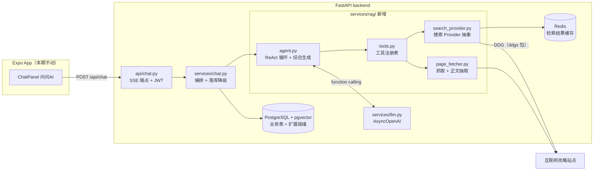
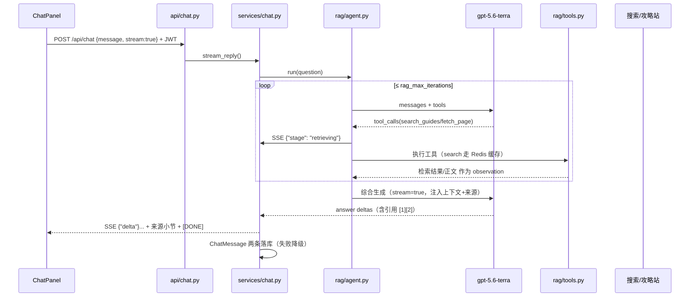

# 游戏攻略 RAG Agent 与 PostgreSQL 迁移设计

## 背景和目标

项目定位已升级为对外展示的技术成果（面试讲述用），方向选定「垂直领域 RAG 问答/攻略聚合」，首发领域为游戏攻略。本设计覆盖两条互为地基的线：

- **Track A（地基）**：后端存储从 MySQL 全量迁移到 PostgreSQL + pgvector。本地先行完成，云服务器暂不处理。PG 同时是二期本地攻略语料库（向量检索）的载体，一次到位避免二次返工。
- **Track B（主体）**：把现有「问问AI」聊天入口升级为游戏攻略 RAG Agent——手写 ReAct 循环（不用 LangChain），基于已验证支持 function calling 的 `gpt-5.6-terra`，实时检索多来源攻略并生成带引用的回答。聚合模式为「实时检索 + 来源引用」，不整篇抓取存储受版权保护的攻略文章。
- **Track C（顺带闭环）**：题库收敛与开源导入——题库域收敛为前端、后端两个职业（其余 9 个缺乏开源题库与官方学习文档的职业删除），现存题库整体换血为真实开源题库。这正是本项目最初的痛点（「LLM 生成的 50 道题质量不高」——这批题恰恰混在种子数据里无法按字段甄别），借迁移一次性闭环。

学习目标：Agent 开发（工具调用、决策循环）、生产级数据库迁移。两个故事互相独立又同属一个 app，面试可分开讲。

## 当前代码库现状

分层架构（api / schemas / services / repositories / models / core），由 `tests/test_architecture.py` 用 AST 守卫强制。关键事实：

- **存储**：MySQL（PyMySQL 驱动，`mysql+pymysql://...?charset=utf8mb4`），同步 `create_engine` + `SessionDep`。Alembic 已接入但 0001 基线为空（只 stamp），存在「完整 initial migration 缺失」已知 TODO（`docs/deployment-and-migrations.md`）。
- **聊天链路**：`POST /api/chat`（JWT 认证，SSE/非流式双模式）→ `services/chat.py`（`reply` / `stream_reply`，SSE 分帧 `data: {"delta": ...}` + `[DONE]`，存库失败降级不阻塞）→ `services/llm.py`（全局 `AsyncOpenAI`，单条消息无历史无 tools）→ `ChatMessage` 表落库。
- **前端**：Expo 端 `ChatPanel` 在客户端拼整段对话历史（`buildPrompt`），服务端只需单轮能力；SSE 解析 `{"delta"}` / `{"error"}` / `[DONE]`，未知字段忽略。
- **缓存**：`core/cache.py` Redis 封装（fail-open、`cache_aside`、`delete_prefix`），`cache_keys.py` 统一 `jd:<域>:<对象>` 命名。
- **测试**：SQLite 内存库 fixture + fakeredis；CI（GitHub Actions）跑 pytest，覆盖率门槛 80%。
- **部署**：`docker-compose.yml`（生产基线：nginx/backend/redis/mysql/adminer）+ `docker-compose.override.yml`（本地叠加）。nginx 对 `/api/chat` 已关闭 proxy_buffering、read_timeout 300s。
- **方言触点盘点**（迁移影响面）：
  - 必改：`config.py` 连接串（charset 参数 PG 不认）、compose 的 mysql 服务与全部 `MYSQL_*` 变量、requirements 驱动依赖
  - 需适配：`question_bank.py` 的 `_is_content_hash_conflict()` 靠匹配 MySQL 错误串（"duplicate entry"）判重，PG/SQLite 错误形态不同
  - 无需改：`repositories/job.py` 的 `_random_func()` 已按引擎分支（非 mysql 走 `func.random()`）；`health.py` 的 `SELECT 1` 可移植；`content_hash` unique + 多 NULL 语义 PG 一致；JSON 列走 SQLAlchemy 通用 JSON 类型（PG 映射 json，SQLite 映射 TEXT，测试不受影响）

## 总体架构



## Track A：MySQL → PostgreSQL 全量迁移（本地）

### 配置与驱动

- 驱动选 **psycopg 3（同步）**：与 FastAPI 官方全栈模板当前选型一致，且现有全部 repositories/services 都是同步 Session，改驱动不动业务层。URL 形态 `postgresql+psycopg://`。
- `config.py`：`mysql_*` 字段替换为 `postgres_host / postgres_port / postgres_user / postgres_password / postgres_database`；`database_url` property 同名保留，去掉 charset 参数。
- 依赖：requirements.txt 移除 `PyMySQL`、`cryptography`（MySQL8 认证用），新增 `psycopg[binary]`、`httpx`（目前只在 dev 里有）、`ddgs`（DDG 搜索，Track B）。

### Docker Compose

- `docker-compose.yml` 基线中 mysql 服务替换为 postgres 服务：镜像 `pgvector/pgvector:pg18`（官方 postgres 镜像 + 预装扩展，环境变量/端口/卷语义完全一致），healthcheck 用 `pg_isready`，backend `depends_on: condition: service_healthy`。
- 数据卷 `mysql_data` → `postgres_data`；Adminer 保留（原生支持 PG）。
- `.env` / `.env.example`：`MYSQL_*` 全量替换为 `POSTGRES_*`。迁移窗口期 `.env` 里临时保留一份 `MYSQL_*`（仅供数据迁移脚本读源库，迁移完成后删除）。
- 云服务器不处理：线上容器不受影响（不会自动拉新配置），重新部署与线上数据迁移是后续独立迭代。

### Alembic 重建基线

- 新的 PG 库是全新空库（结构由迁移脚本之外的标准流程建立，数据由脚本搬运），因此 **PG 迁移谱系重新开基线**：生成一个完整建表 revision（全部业务表 + 索引 + `CREATE EXTENSION IF NOT EXISTS vector`），作为新的根节点（`down_revision=None`）。MySQL 时代的两个旧 revision 从链上摘除（保留文件、注释标记为 MySQL 时代历史）。
- 这一步同时解决「完整 initial migration 缺失」的历史 TODO：从此表结构变更必须走 Alembic，`auto_create_tables` 仅开发环境保留。
- 旧 revision 的摘除方式必须明确：**文件移出 `alembic/versions/` 目录**（挪到 `alembic/legacy_mysql/` 归档并加说明），而不是留在原目录——否则两个 `down_revision=None` 的根会形成 multiple heads，`upgrade head` 直接报错。
- `CREATE EXTENSION` 需要 superuser/owner 权限：本地 compose 的 `POSTGRES_USER` 即 superuser，直接可用；未来上云时用独立迁移或初始化脚本执行（设计内注明，不在本期）。

### 方言适配清单

| 位置 | 改动 |
|---|---|
| `config.py` | 连接串构造（上文） |
| `question_bank.py` `_is_content_hash_conflict` | 重写并更名为 `_is_unique_violation(exc, constraint)`：跨驱动判定——优先读 `exc.orig` 的 `sqlstate == "23505"`（psycopg3），兼容 pymysql 的 `args[0] == 1062` 与 SQLite 的 "UNIQUE constraint failed" 串匹配，并校验约束名含 `content_hash`。内存 known_hashes 仍是主判重路径，此处只是并发兜底 |
| `repositories/job.py` | 无需改（`_random_func` 已分支） |
| 模型层 | 无需改。JSON 列维持通用 `JSON` 类型（PG 存 json）；升级 JSONB 与向量表一起留到二期 |

### 数据迁移脚本

`app/migrate_mysql_to_pg.py`（沿用 `python -m app.xxx` 的脚本惯例）：

- 读源：用 `.env` 里保留的 `MYSQL_*` 临时建只读 MySQL 引擎；写目标：现有 `settings.database_url`（PG）。
- 按 `alembic upgrade head` 建好 PG 表结构后，按外键依赖顺序逐表搬：`users → jobs / industries / career_paths / current_jobs → tasks / task_operation_records → chat_messages`，批量 insert（questions 不在其中，原因见下）。
- **收敛过滤（Track C 联动）**：按 `KEEP_JOBS = {"frontend", "backend"}` 过滤——jobs 只搬这两个职业；**questions 整表不迁移**：最初 LLM 凭空生成的 50 道题混在种子数据里（hash 为 NULL，与手工好题无字段级区分，且是否跑过 backfill 补 hash 不确定），与其甄别不如换血，由开源导入管道在 PG 全量重建（见 Track C）；career_paths 只搬对应两条；current_jobs 的 recommendations（JSON）过滤掉指向已删 targetId 的项（过滤后为空的小节在前端现状下只剩标题没有卡片，一期接受、不动前端）；industries 与用户数据（users / tasks / chat_messages）全量搬。
- **保护性约束**：目标表非空则拒绝执行并打印行数（不做任何 truncate/覆盖类操作）；MySQL 源库只读不写。
- 对账：期望行数 = 源行数经收敛规则推导（questions 期望为 0）；逐表对比 + 不变量断言「保留 career_paths 的 steps[].quizJobId ⊆ KEEP_JOBS」；各表丢弃行数与样例清单单列输出，便于人工确认没有误伤。
- 已知历史问题顺带记录不处理：`chat_messages.user_id` 存在 nullable 历史数据（`docs/deployment-and-migrations.md` 已知 TODO），原样搬迁。

## Track B：游戏攻略 RAG Agent（升级「问问AI」）

### 模块边界

新增 `app/services/rag/` 包，遵守现有分层守卫（services 不 import fastapi）：

- `agent.py` —— ReAct 循环编排 + 终答综合
- `tools.py` —— 工具注册表：OpenAI tools schema + Python 执行器的一一对应
- `search_provider.py` —— `SearchProvider` 协议 + DDG 实现（可替换）
- `page_fetcher.py` —— URL 抓取与正文抽取

`services/chat.py` 的 `reply` / `stream_reply` 入口签名不变，内部按 `settings.rag_enabled` 分流：True 走 Agent 管线，False 走现有直连 LLM 路径（既是回滚开关，也是 A/B 对比入口）。

### ReAct 循环与工具

**两段式设计**（关键取舍：现有 SSE 流式体验不能退化）：

1. **检索循环**（非流式，有界）：循环把对话 + 工具定义交给模型；模型返回 tool_calls 则执行工具、把结果作为 observation 追加，继续下一轮；返回纯文本或达到 `rag_max_iterations`（默认 4）则结束。产出：检索上下文 + 实际使用的来源列表。
2. **综合生成**（流式）：一次独立的 `stream=True` 调用，system prompt 注入检索上下文与编号来源列表，要求正文用 `[1][2]` 引用。SSE delta 直接透传给前端，保持现有打字机体验。代价是普通闲聊多一次轻量调用，换来管线统一。

工具定义（一期两个）：

```python
search_guides(query: str) -> list[SearchHit]   # 调搜索 API：title/url/snippet，默认取 5 条
fetch_page(url: str) -> str                    # 抓页面正文，截断到 rag_fetch_max_chars（默认 8000）
```

系统提示词定位：游戏攻略助手——攻略类问题必须检索后作答并引用来源；非游戏问题可直接回答（路由决策由模型是否发起工具调用自然涌现，不写硬编码路由）。

**引用溯源是服务端保证的，不依赖模型自觉**：来源编号列表由 `agent.py` 从「实际被 fetch_page 用过的 URL + search 返回的候选」确定性组装，追加在回答末尾的「来源」小节；模型只在正文里引用编号。

### SearchProvider 抽象

```python
class SearchProvider(Protocol):
    async def search(self, query: str, max_results: int) -> list[SearchHit]: ...
```

一期原计划只实现 `DDGProvider`——基于 `ddgs` 包（原 duckduckgo_search 更名而来），免注册、无 API Key。**实测后改了主实现**，理由记在下面，因为这是本设计里唯一被现实推翻的决策：

- DDG 在开发网络下不可用：头一两次请求成功（1.7~6.7s），之后被限流且不恢复，连续 5 次只成功 2 次
- 多后端并列反而更糟：`ddgs` 内部用 `return_when=FIRST_EXCEPTION` 并发批量跑，一个秒失败的后端会把另一个正在返回结果的后端一起带走——多后端不是冗余，是互相拖累
- 用户明确不接受注册第三方搜索服务，所以 Tavily / 博查这条路排除

**改为 `MediaWikiProvider` 作默认实现**（`app/services/rag/wiki_provider.py`）：游戏攻略天然沉淀在 wiki 上，而 wiki 提供的是正规 API 而不是被爬的网页——结构化、有稳定的页面 URL（利于引用溯源）、免注册。默认站点白名单 `wiki_sites = "ys,sr,zzz"`（biligame 游戏 wiki，实测 0.4~1.6s 可用）。

`DDGProvider` **保留**为备选实现，通过 `settings.search_provider` 在 `"wiki"` / `"ddg"` 间切换——这正是当初抽 Protocol 的用处兑现：换数据源，agent 和 tools 零改动。

已知限制，不藏着：
- 站点是白名单式的，问到没配的游戏就检索不到。这是刻意取舍——比「什么都搜但一半时间失败」更可预期
- biligame 有 WAF，请求密了返回 **567**。已做退避重试一次 + 单站失败不影响其他站；Redis 检索缓存是主要护栏
- MediaWiki 的 `srsearch` 对多词查询偏 AND，「纳塔 火神」可能 0 命中而「纳塔」有结果。这依赖 Agent 换关键词重试（B2 的 observation 机制），不在 Provider 里做查询改写

`page_fetcher.py` 的 SSRF 防护是四道而不是「基础防护」，因为它的 URL 参数最终来自模型输出：① 协议白名单（仅 http/https）② 目标 IP 校验（禁私网/回环/链路本地，且必须校验 `getaddrinfo` 返回的**全部** IP）③ 重定向**逐跳**校验（公网域名 302 到 127.0.0.1 是最经典的绕过，所以不能用 `follow_redirects=True`）④ 内容类型 + 体积（2MB）+ 超时（10s）上限。残留风险已记录：DNS rebinding（检查时与使用时解析结果不同）未处理。

### SSE 协议扩展（向后兼容）

现有事件不动，新增一种可选事件，旧前端解析逻辑不受影响（未知字段被忽略）：

```
data: {"stage": "retrieving", "detail": "正在搜索：塞尔达传说 神庙攻略"}
data: {"delta": "..."}        # 现有
data: {"error": "..."}        # 现有
data: [DONE]                  # 现有
```

`ChatMessage` 落库不变（user + assistant 两条，来源列表已内嵌在 assistant 文本里），**不加表、不加列**。

### 检索缓存

复用 `core/cache.py`:key `jd:rag:search:<sha1(归一化query)>:<条数>`，TTL 默认 600s。同一攻略问题短时间内重复问，搜索 API 只打一次（LLM 调用不缓存——上下文相关）。缓存 fail-open 语义沿用现有实现，Redis 挂了只是慢一点。

实现上多了一个 `cache_aside_async`：原有的 `cache_aside` 的 loader 是同步 callable，而检索是协程。Python 里同步/异步无法在一个函数里透明兼容（colored functions），所以分成两个函数，Redis 读写仍走同步客户端（毫秒级操作 + 已有 0.5s 超时兜底，为它引入一套异步客户端不划算，且与项目里同步 Session 的风格一致）。

key 里带条数是必要的：要 3 条和要 10 条不能共用缓存，否则第二次只能拿到 3 条。

### 配置项（config.py 新增）

```
rag_enabled: bool = True                     # Agent 管线开关（False 回退直连 LLM，也是回滚开关）
rag_max_iterations: int = 4                  # 检索循环上限
rag_search_max_results: int = 5
rag_fetch_max_chars: int = 8000
rag_fetch_timeout_seconds: float = 10.0
rag_query_cache_ttl_seconds: int = 600

search_provider: str = "wiki"                # "wiki"（默认）| "ddg"（备选）
search_api_key: str = ""                     # 仅 key 型 Provider 使用，wiki/ddg 都留空

# wiki Provider
wiki_base_url: str = "https://wiki.biligame.com"
wiki_sites: str = "ys,sr,zzz"                # 站点白名单，一个 slug 一个游戏
wiki_search_limit_per_site: int = 5
wiki_request_timeout_seconds: float = 8.0
wiki_retry_delay_seconds: float = 1.0        # 遇 429/503/567 退避重试一次

# ddg Provider（备选）
search_region: str = "cn-zh"
search_backends: str = "brave"                # 不要用 "auto"，也不要并列多个，见上文实测
search_request_timeout_seconds: float = 8.0
search_timeout_seconds: float = 20.0
```

## Track C：题库收敛与开源导入

### 收敛规则

- `jobs` 只保留 `frontend` / `backend`；`questions` 整表丢弃重建——痛点题混在种子题里且无字段级区分，全量换血比甄别干净：重建来源全部带 `source_url` 溯源，质量与出处一次到位
- `career_paths` 只保留对应两条路径；`current_jobs` 行保留，recommendations 过滤后为空的小节在前端现状下只剩标题（一期接受，不动前端）
- `industries` 与用户数据（users / tasks / chat_messages）不动
- `seed.py` 同步精简：JOBS 保留 2 条、QUESTIONS 清零——题库一律由导入管道供给，全新环境与迁移后环境语义一致（初始化顺序：`alembic upgrade head` → seed → `import_question_banks`）
- 落地时机：收敛在迁移脚本里按 keep-list 一次完成，不写单独的删除脚本，MySQL 源库依旧只读

### 开源导入管道

两条管道，产物统一走**现有的** `POST /api/admin/questions/batch`（X-API-Key 鉴权 + content_hash 去重 + 逐题校验，全部现成）：

- **前端直导（零 LLM）**：解析 `lydiahallie/javascript-questions` 中文版 README——本身就是「题干+选项+答案+解析」的 MCQ 结构，纯文本解析成 `QuestionInput`，`source_url` 填仓库地址；约 180+ 道，批量接口单批上限 100，脚本自动分批提交
- **后端 LLM 有锚点改编**：JavaGuide / doocs 八股是问答体，用 `gpt-5.6-terra` 改编成 MCQ——题干与正确答案来自原文，LLM 只负责压缩题干、生成干扰项、浓缩解析（≤1024 字）；`source_url` 必填锚点文档地址；产出先本地过 `QuestionInput` + `validate_question` 干跑，再提交；支持按文档目录圈定导入范围（MySQL / Redis / 网络 / OS 等）
- 脚本 `app/import_question_banks.py`（`python -m app.import_question_banks`，沿用脚本惯例），支持 `--dry-run` 只校验不提交

## 数据流（一次攻略问答）



## 错误处理、兼容性与边界情况

- **LLM 失败**：沿用现有行为——非流式抛 `UpstreamServiceError`（502，不泄露上游细节），流式发 `{"error"}` 事件后 `[DONE]`。
- **搜索 API 失败/超时**：工具错误不终止请求——错误信息作为 observation 返回给模型，让它改写关键词重试或声明检索失败后凭常识作答（prompt 约束：无来源不得虚构攻略细节）。
- **循环失控**：`rag_max_iterations` 硬上限；单工具超时 10s；fetch 有响应大小与重定向上限。
- **SSRF 基础防护**：见 page_fetcher。
- **API 兼容**：`/api/chat`、`/api/messages` 契约不变，前端零改动即获得升级；新 SSE 事件向后兼容。
- **数据兼容**：业务数据经脚本完整搬迁并逐表对账；MySQL 源只读。
- **测试兼容**：CI 仍是 SQLite 内存库（通用 JSON、无 PG 专有列类型进模型层，故不受迁移影响）。
- **云服务器**：明确不动。线上继续跑 MySQL 版本，直到后续专门的线上切换迭代（重新部署 + 线上数据迁移 + DNS/回滚方案）。

## 测试策略

- **Agent 循环单测**（核心）：脚本化假 LLM——第一轮返回 tool_calls、第二轮返回终文，断言工具被执行、observation 被追加、来源列表确定性组装；再覆盖达到迭代上限、工具抛错降级两条路径。不打真网。
- **SearchProvider 单测**：mock `ddgs` 包返回，断言 SearchHit 映射与异常包装；缓存命中路径用 fakeredis。
- **题库导入管道**：lydiahallie 解析器用样例 markdown fixture 单测（题干/选项/答案/解析四要素抽取）；LLM 改编产物校验用 fake LLM 返回固定 JSON 单测，覆盖非法产物被拒的路径。
- **SSE 集成测试**：沿用 `test_chat_admin_api.py` 的 fake 注入模式，断言新 `{"stage"}` 事件顺序、`[DONE]` 结尾、502 不泄露上游错误、`rag_enabled=False` 回退路径。
- **迁移脚本**：对账函数单测（构造源/目标数据集断言报告）；端到端搬运在本地真实 MySQL→PG 上手动执行一次并留对账输出。
- **判重适配**：`_is_unique_violation` 用合成异常（psycopg/pymysql/sqlite 三形态）做参数化单测。
- **分层守卫**：`test_architecture.py` 必须继续通过。注意其 `_python_files()` 目前是非递归 glob，只覆盖 `app/services/` 顶层文件——需顺手改为 `rglob` 递归收集，否则新增的 `services/rag/` 子包会静默脱离守卫（守卫测试"仍然通过"反而是虚假安全感）。

## 明确不做的内容（一期边界）

- 不做本地攻略语料库与 embedding 摄入——`CREATE EXTENSION vector` 已就绪，但向量表 DDL 留到二期（维度是 DDL 常量，取决于二期 embedding 模型选型，现在定是拍脑袋）
- 不建 ANN 索引（无数据无意义；二期按数据量定 HNSW 参数）
- 不做多轮服务端对话（前端已客户端拼历史，够用；服务端会话二期）
- 不动 Expo 前端（下一迭代做攻略问答的专属 UI：阶段提示、来源卡片）
- 不动云服务器、不做线上切换
- 不引入 LangChain/LangGraph 等框架
- 不实现 Tavily / 博查等 key 型 Provider（协议抽象已预留，DDG 不可达时再加）
- 不把 JSON 列升级 JSONB（二期随向量表一起评估）

## 前置依赖（需要你完成的动作）

无。搜索走 `ddgs` 免注册方案（原 Tavily 注册要求已按你的反馈移除）；LLM 网关已验证连通；PG 由 compose 拉起；开源题库从 GitHub 公开仓库拉取；数据迁移脚本我来写。唯一的环境前提：本机能直连 DuckDuckGo（或配置标准 `HTTPS_PROXY`），跑不通时告诉我再换 Provider。
