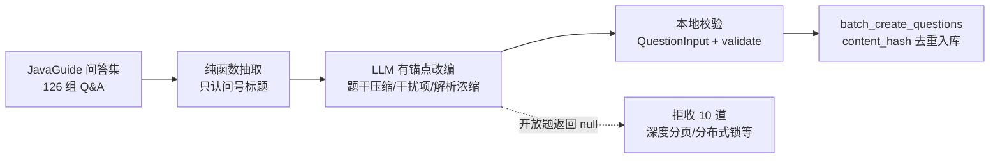

# 17. 题库重建管道:开源直导 + LLM 有锚点改编

> 2026-09 完成。这是本项目最初的痛点——「让 LLM 凭空生成 50 道题,
> 质量不够高」——的最终解法。前端 155 道 + 后端 116 道,全部带溯源。

## 一句话故事

「我用两条管道重建了题库:前端从开源 MCQ 仓库纯文本解析直导,
后端把开源八股问答交给 LLM 做**有锚点改编**——LLM 只负责编干扰项,
不负责产出知识。271 道题每道都能点开来源链接核对。」

## 核心设计判断:LLM 当改编者,不当出题人

最初的失败模式:让 LLM「出 50 道前端面试题」——无锚点生成,
模型只能围绕它最有把握的几个知识点反复编题,答案无处核对,
质量天然不可控。

改造后的模式(后端轨道):

正确性锚在哪里:**正确选项的内容必须来自参考答案**——LLM 做的是
「格式转换 + 干扰项生成」,幻觉风险从「答案可能错」降到
「干扰项可能不够好」,差了一个量级。

## 两个反直觉的经验

### 1. 开放题宁可不收

LLM 被明确授权返回 null:「开放设计题/代码题不适合改编为选择题」。
实际拒收了 10 道——「深度分页如何优化」「如何实现分布式锁」
「TCP TIME_WAIT 在等什么」。这些正是当初 LLM 凭空生成时最容易
编出「看似有理实则空洞」选项的类型。**过滤器丢掉 8% 的量,
换来的是题库里没有一道伪选择题。**

### 2. 纯文本解析比想象的曲折(前端轨道)

lydiahallie/javascript-questions 是全网独一份的「开箱即用 MCQ 仓库」
(MIT 协议、官方中文版、天然四要素结构),但解析仍然踩了三个坑:
- 部分标题带 `` 锚点前缀,标题正则要兼容
- 代码块行会被「题干续行」分支吞掉,状态机分支顺序必须先判代码围栏
- 答案行用全角冒号「答案:D」——正则两种冒号都得接

教训:**解析器必须是纯函数**,用固定 markdown 样例做单测
(9 个用例覆盖锚点/HTML/多选/缺答案/超长),改一处跑一遍,
而不是对着 5000 行原文肉眼验证。

## 管道的工程护栏(三层防线)

| 防线 | 机制 | 拦什么 |
|---|---|---|
| 结构校验 | `QuestionInput`(extra=forbid)+ `validate_question` | 字段缺失、超长、选项数、答案越界 |
| 内容去重 | `content_hash`(sha256 of 规范化题干+选项) | 重复导入、重复题 |
| 溯源 | 每题 `source_url` 指向 GitHub 锚点文档 | 无出处的内容根本进不了库 |

入库走 `batch_create_questions`——与 `POST /api/admin/questions/batch`
同一段代码(SAVEPOINT 部分成功语义),脚本直调省去起服务的一跳。

## 网络边角(值得记)

本机网络对 `raw.githubusercontent.com` 不通、对 `github.com` 主站可达
——所以取数用浅克隆(`git clone --depth 1`)而不是 raw 下载,
镜像站(jsdelivr/ghproxy 等)在这个网络环境全部失效。

## 面试怎么讲

- 被问「LLM 生成内容的质量怎么保证」:拿这个管道答——有锚点改编 +
  结构校验 + null 过滤 + 人工抽检,每层都有明确的失败模式;
- 被问「为什么不用 LangChain/现成 RAG 框架做这件事」:
  改编是一次性批处理,引入 agent 框架是过度工程;
  (而下一章的检索问答才是 Agent 该出场的地方——边界感本身是加分项)
